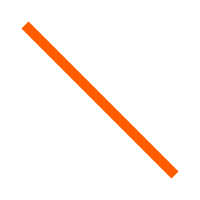
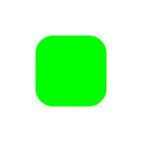
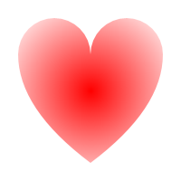
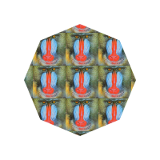

# Pixie - A full-featured 2D graphics library for Nim

Pixie is a 2D graphics library similar to [Cairo](https://www.cairographics.org/) and [Skia](https://skia.org) written (almost) entirely in Nim.

This library is being actively developed and we'd be happy for you to use it.

`nimble install pixie`

Features:
* Typesetting and rasterizing text, including styled rich text via spans.
* Drawing paths, shapes and curves with even-odd and non-zero windings.
* Pixel-perfect AA quality.
* Supported file formats are PNG, BMP, JPG, SVG + more in development.
* Strokes with joins and caps.
* Shadows, glows and blurs.
* Complex masking: Subtract, Intersect, Exclude.
* Complex blends: Darken, Multiply, Color Dodge, Hue, Luminosity... etc.
* Many operations are SIMD accelerated.

### Documentation

API reference: https://nimdocs.com/treeform/pixie/pixie.html

### Image file formats

Format        | Read          | Write         |
------------- | ------------- | ------------- |
PNG           | ✅           | ✅            |
JPEG          | ✅           |               |
BMP           | ✅           | ✅            |
GIF           | ✅           |               |
SVG           | ✅           |               |

### Font file formats

Format        | Read
------------- | -------------
TTF           | ✅
OTF           | ✅
SVG           | ✅

### Joins and caps

Supported Caps:
  * Butt
  * Round
  * Square

Supported Joins:
  * Miter (with miter angle limit)
  * Bevel
  * Round

### Blending & masking

Supported Blend Modes:
  * Normal
  * Darken
  * Multiply
  * ColorBurn
  * Lighten
  * Screen
  * Color Dodge
  * Overlay
  * Soft Light
  * Hard Light
  * Difference
  * Exclusion
  * Hue
  * Saturation
  * Color
  * Luminosity

Supported Mask Modes:
  * Mask
  * Overwrite
  * Subtract Mask
  * Intersect Mask
  * Exclude Mask

### SVG style paths:

Format        | Supported     | Description           |
------------- | ------------- | --------------------- |
M,m           | ✅            | move to               |
L,l           | ✅            | line to               |
h,h           | ✅            | horizontal line to    |
V,v           | ✅            | vertical line to      |
C,c,S,s       | ✅            | cublic to             |
Q,q,T,t       | ✅            | quadratic to          |
A,a           | ✅            | arc to                |
z             | ✅            | close path            |

### Realtime Examples

Here are some examples of using Pixie for realtime rendering with some popular windowing libraries:

* [examples/realtime_glfw.nim](examples/realtime_glfw.nim)
* [examples/realtime_glut.nim](examples/realtime_glut.nim)
* [examples/realtime_sdl.nim](examples/realtime_sdl.nim)
* [examples/realtime_win32.nim](examples/realtime_win32.nim)

## Testing

`nimble test`

## Examples

### Text
[examples/text.nim](examples/text.nim)
```nim
var font = readFont("tests/fonts/Roboto-Regular_1.ttf")
font.size = 20

let text = "Typesetting is the arrangement and composition of text in graphic design and publishing in both digital and traditional medias."

image.fillText(font.typeset(text, bounds = vec2(180, 180)), vec2(10, 10))
```


### Text spans
[examples/text_spans.nim](examples/text_spans.nim)
```nim
let font = readFont("tests/fonts/Ubuntu-Regular_1.ttf")

proc style(font: Font, size: float32, color: ColorRGBA): Font =
  result = font
  result.size = size
  result.paint.color = color

let spans = @[
  newSpan("verb [with object] ", font.style(12, rgba(200, 200, 200, 255))),
  newSpan("strallow\n", font.style(36, rgba(0, 0, 0, 255))),
  newSpan("\nstral·low\n", font.style(13, rgba(0, 127, 244, 255))),
  newSpan("\n1. free (something) from restrictive restrictions \"the regulations are intended to strallow changes in public policy\" ",
      font.style(14, rgba(80, 80, 80, 255)))
]

image.fillText(typeset(spans, bounds = vec2(180, 180)), vec2(10, 10))
```


### Square
[examples/square.nim](examples/square.nim)
```nim
let ctx = newContext(image)
ctx.fillStyle = rgba(255, 0, 0, 255)

let
  pos = vec2(50, 50)
  wh = vec2(100, 100)

ctx.fillRect(rect(pos, wh))
```


### Line
[examples/line.nim](examples/line.nim)
```nim
let ctx = newContext(image)
ctx.strokeStyle = "#FF5C00"
ctx.lineWidth = 10

let
  start = vec2(25, 25)
  stop = vec2(175, 175)

ctx.strokeSegment(segment(start, stop))
```


### Rounded rectangle
[examples/rounded_rectangle.nim](examples/rounded_rectangle.nim)
```nim
let ctx = newContext(image)
ctx.fillStyle = rgba(0, 255, 0, 255)

let
  pos = vec2(50, 50)
  wh = vec2(100, 100)
  r = 25.0

ctx.fillRoundedRect(rect(pos, wh), r)
```


### Heart
[examples/heart.nim](examples/heart.nim)
```nim
image.fillPath(
  """
    M 20 60
    A 40 40 90 0 1 100 60
    A 40 40 90 0 1 180 60
    Q 180 120 100 180
    Q 20 120 20 60
    z
  """,
  parseHtmlColor("#FC427B").rgba
)
```


### Masking
[examples/masking.nim](examples/masking.nim)
```nim
let ctx = newContext(lines)
ctx.strokeStyle = "#F8D1DD"
ctx.lineWidth = 30

ctx.strokeSegment(segment(vec2(25, 25), vec2(175, 175)))
ctx.strokeSegment(segment(vec2(25, 175), vec2(175, 25)))

mask.fillPath(
  """
    M 20 60
    A 40 40 90 0 1 100 60
    A 40 40 90 0 1 180 60
    Q 180 120 100 180
    Q 20 120 20 60
    z
  """
)
lines.draw(mask)
image.draw(lines)
```


### Gradient
[examples/gradient.nim](examples/gradient.nim)
```nim
let paint = Paint(
  kind: pkGradientRadial,
  gradientHandlePositions: @[
    vec2(100, 100),
    vec2(200, 100),
    vec2(100, 200)
  ],
  gradientStops: @[
    ColorStop(color: rgba(255, 0, 0, 255), position: 0),
    ColorStop(color: rgba(255, 0, 0, 40), position: 1.0),
  ]
)

image.fillPath(
  """
    M 20 60
    A 40 40 90 0 1 100 60
    A 40 40 90 0 1 180 60
    Q 180 120 100 180
    Q 20 120 20 60
    z
  """,
  paint
)
```


### Image tiled
[examples/image_tiled.nim](examples/image_tiled.nim)
```nim
var path: Path
path.polygon(
  vec2(100, 100),
  70,
  sides = 8
)
image.fillPath(
  path,
  Paint(
    kind: pkImageTiled,
    image: readImage("tests/images/png/baboon.png"),
    imageMat: scale(vec2(0.08, 0.08))
  )
)
```


### Shadow
[examples/shadow.nim](examples/shadow.nim)
```nim
let polygonImage = newImage(200, 200)

let ctx = newContext(polygonImage)
ctx.fillStyle = rgba(255, 255, 255, 255)

ctx.fillPolygon(
  vec2(100, 100),
  70,
  sides = 8
)

let shadow = polygonImage.shadow(
  offset = vec2(2, 2),
  spread = 2,
  blur = 10,
  color = rgba(0, 0, 0, 200)
)

image.draw(shadow)
image.draw(polygonImage)
```


### Blur
[examples/blur.nim](examples/blur.nim)
```nim
let mask = newMask(200, 200)
mask.fillPolygon(vec2(100, 100), 70, sides = 6)

blur.blur(20)
blur.draw(mask, blendMode = bmMask)

image.draw(trees)
image.draw(blur)
```


### Tiger
[examples/tiger.nim](examples/tiger.nim)
```nim
let tiger = readImage("examples/data/tiger.svg")

image.draw(
  tiger,
  translate(vec2(100, 100)) *
  scale(vec2(0.2, 0.2)) *
  translate(vec2(-450, -450))
)
```

